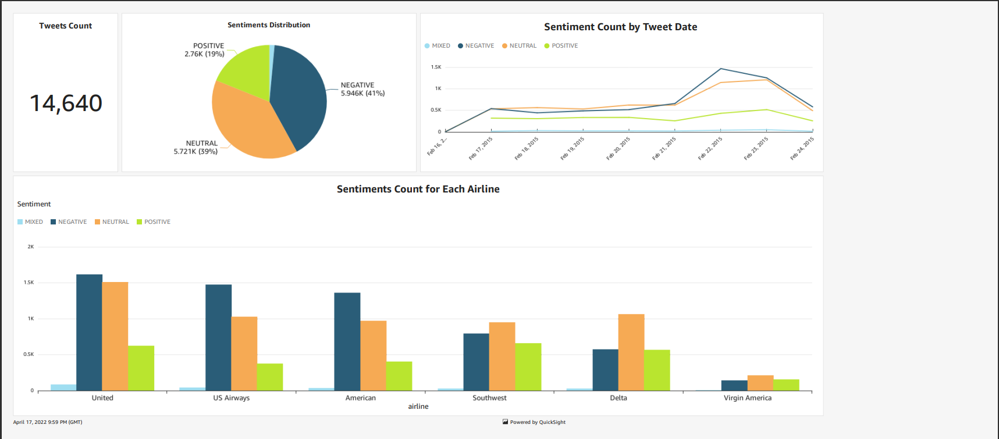
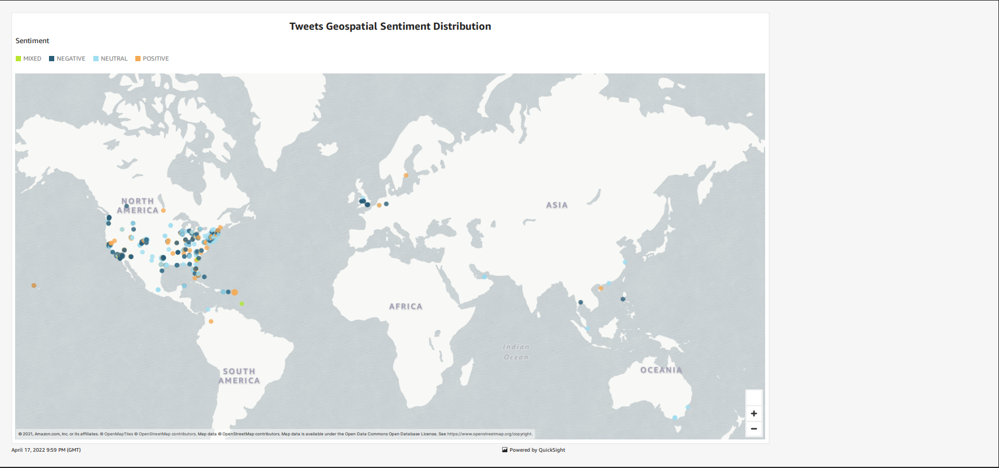

# AI Social Media Sementics Analysis
**Data deduplication project on [Kaggle](https://www.kaggle.com/code/mostafafathy4869/data-fuzzy-matching-and-de-duplication)**

### Description
This is a project where we simulate the analysis of social media tweets using AWS serverless services and providing insights from the tweets as a dashboard in near real time fashion.

### Architecture

### Requirments
All the AWS services needed to be created from the AWS website and configure lambda with the `Code_S3_Triggered_Lambda_Function`  code, then we can send tweets from the data directory from the local machine using the scribt in `Code_Send_Full_Tweets`  and running glue and quicksight in order to produce insightful dashboard

### Dashboards
Dashboard 1

Dashboard 2

 
